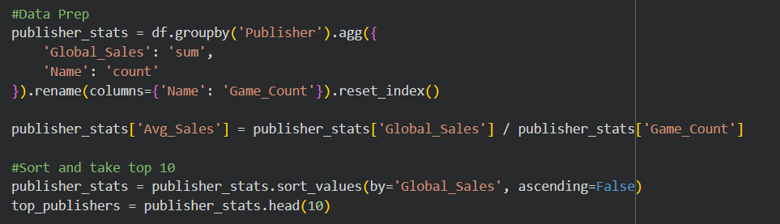
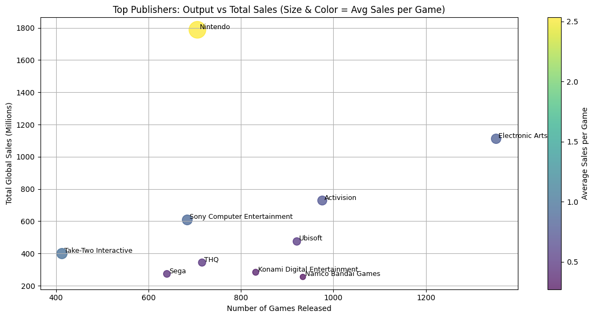
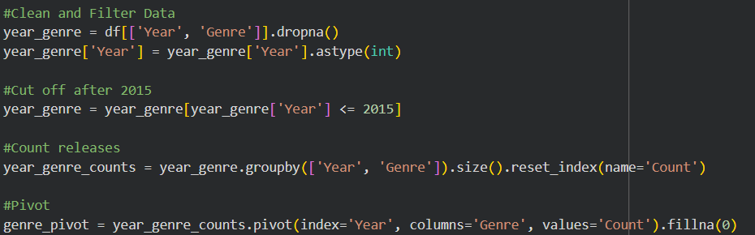
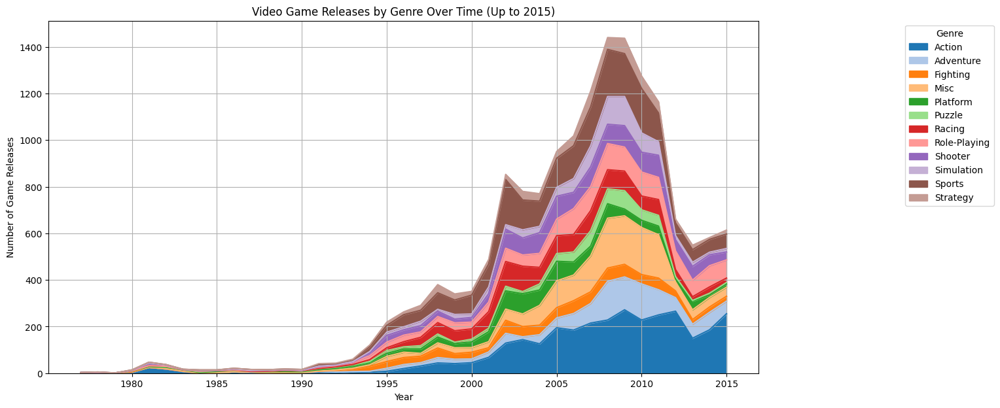
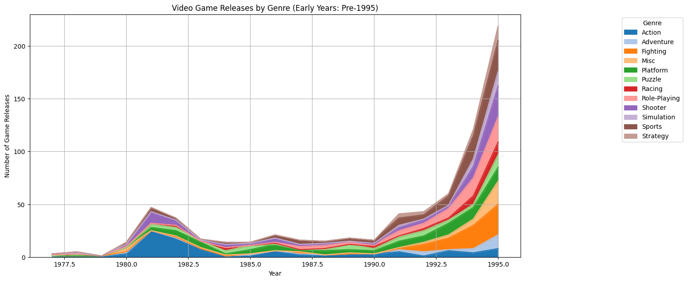
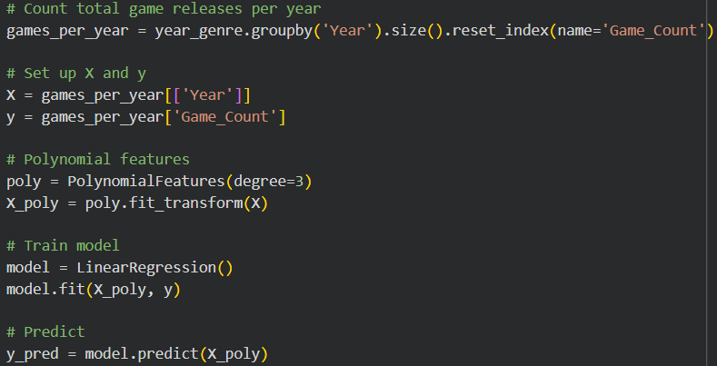
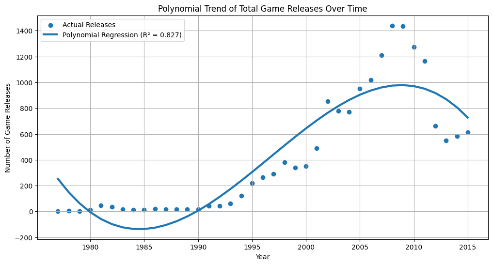

# Final Project for Data Science Fundamentals - Jake Dumas

## Introduction

The purpose of this project was to gain experience in finding, cleaning, querying, and analyzing a dataset to build on the skills I have learned throughout the semester. I was tasked with locating a dataset, creating and answering two research questions, applying a machine learning technique, and creating this documentation. After some deliberation, my group settled on a dataset of video game sales from Kaggle, and I decided to use it to answer more questions. Following our decision These were the questions I decided to choose for myself:
* Which publishers dominate the video game market based on global sales?
* How has the number of game releases changed over time, and what genres are more prevalent in those years?

## Selection of Data

### Dataset Overview

My group chose our [dataset](https://www.kaggle.com/datasets/gregorut/videogamesales) both because of interest and because the large amount of numerical data would allow us to analyze it without too much transformation. Our dataset has several categories:

* The Ranking/Index
* The name of the game at said place
* The platform the game was released
* The year of release
* The game's publisher
* The sales for North America (in millions)
* The sales for Europe (in millions)
* The sales for Japan (in millions)
* The sales for all other countries (in millions)
* The global/total sales overall (in millions)

### Dataset Cleaning

While the data was relatively clean, we still had about 2% (roughly 350 data points) of missing or N/A values. While much of this data was sufficiently low in the ranking to have little effect on our final outcome, we opted to fill in a large chunk of the missing data by hand. The missing data was contained almost entirely in the release year and/or publisher, which can be easily fact-checked and filled in. Through this effort, we reduced the about 350 missing values to 139, which is under 1% of our data. After bringing it to this point, we decided that our data was sufficient to work with and set it up for analysis of our topic questions.

### Data Oddities

Our dataset has a few oddities that we can't really fix or edit. The biggest oddity is that our data is missing sources from particular years, specifically 1979, 2018, and 2019. Some years also have very low numbers of logged releases, which will likely affect our conclusions, likely not significantly, but at least notably.

## Methods

### Packages

* Pandas
* Numpy
* Matplotlib
* Seaborn
* SKLearn
  

### Charting/Machine Learning Applied

* Stacked Area Plot
* Scatter Plot
* Linear Regression
  

### Specific Analysis Features

To make working with our dataset easier, we decided to split our original dataset into several subframes during initialization. While most of these subframes were not utilized, they were a great initial foray into our data. By setting these up, we were able to better understand the information our data contained, explore several different ways to set up later frames, and use shorthands for particular data groups when asking questions.

## Results

### Question 1 (Which publishers dominate the video game market based on global sales?):
I asked this question to see how certain publishers reached the top of their sales and maybe figure out if there are strategies that can generate a lot of revenue. I thought it would be best to group the dataset by publisher, sort by publisher, and take the head of each list.

I originally wanted to make a bar graph, but I thought a bubble chart would be more interesting and different from what I worked on in the group project. I thought the idea of using a scale to measure the total sales and then mapping the important factors to the other axis.

The results show a small trend: some of the top publishers make many sales based on the number of games they release. There are some outliers: Nintendo has the highest sales but fewer games, while Electronic Arts has the most games and decent sales, but still less than Nintendo. There is also Take-Two Interactive, which has the fewest number of games but had a better average sales than Ubisoft, which had more games and total sales. So I would say there isn't a definite strategy for these publishers to achieve significant success.

### Question 2 (How has the number of game releases changed over time and what genres are more prevalent in those years?):
I asked a simpler version of this question for our group project but I wanted to experiment more and see the differences in genres changing over the years. I grouped the dataset by year and genre and counted the number of game releases in each category.

I had to reshape the data into a pivot table for visualization. The idea for a stacked area chart was to show the range in genres over the years. I made two plots one which is cumulative of all data and one that is zoomed in before the large increase in games at around 1995.

To further analyze trends, I applied polynomial regression using scikit-learn to model the relationship between year and total number of game releases. This approach captures the industry's nonlinear growth patterns, including periods of rapid expansion and eventual decline. This is different from my group project model, where I used linear regression before.

* Conclusions for plot 1: We can see a rise in games from the 1980s to a steep increase in the 90s to an even steeper increase in the 2000s, reaching the peak at the start of the 2010s. The dominant genres in the area are sports and action.
* Conclusion for plot 2: Before the late 90s, game releases weren't as prevalent but were still growing gradually. Genres were pretty split evenly, and the action genre has always been popular from the beginning
* Conclusion for plot 3: The polynomial regression model captures the overall lifecycle of the video game industry’s growth, showing a slow start, rapid expansion, and eventual peak.

## Conclusion

After working without data for a while, we came to several conclusions:

* Publisher Dominance is not fully based on the number of games released; instead, making high-performing titles is more important to succeed.
* The video game industry has grown over time with more releases and more genres growing, while some genres become more prevalent than others.

If given the opportunity, we'd like to expand our dataset by a few years and see how these questions and charts change. The last few years have seen a major increase in the number of games released per year, and it would be interesting to see how they fare against the high-earning years outlined in our current dataset.
